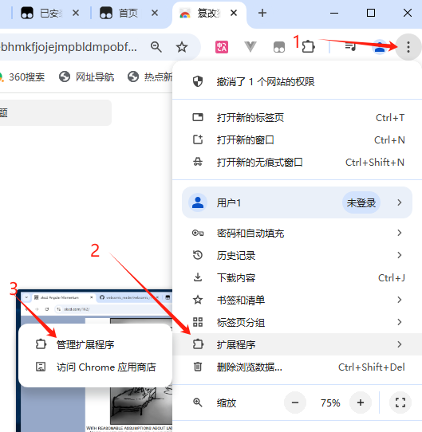
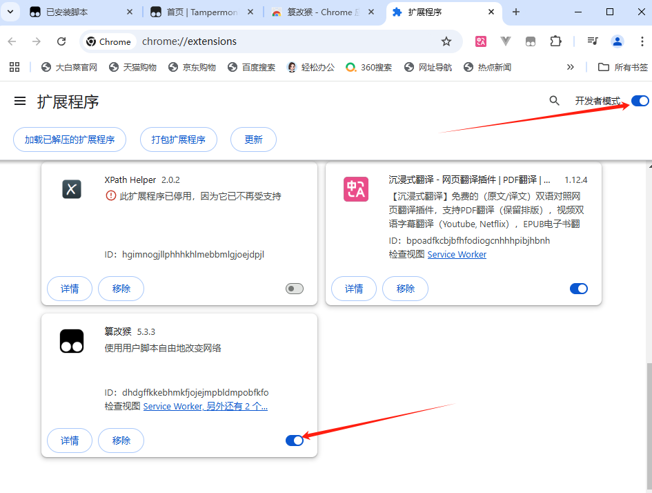
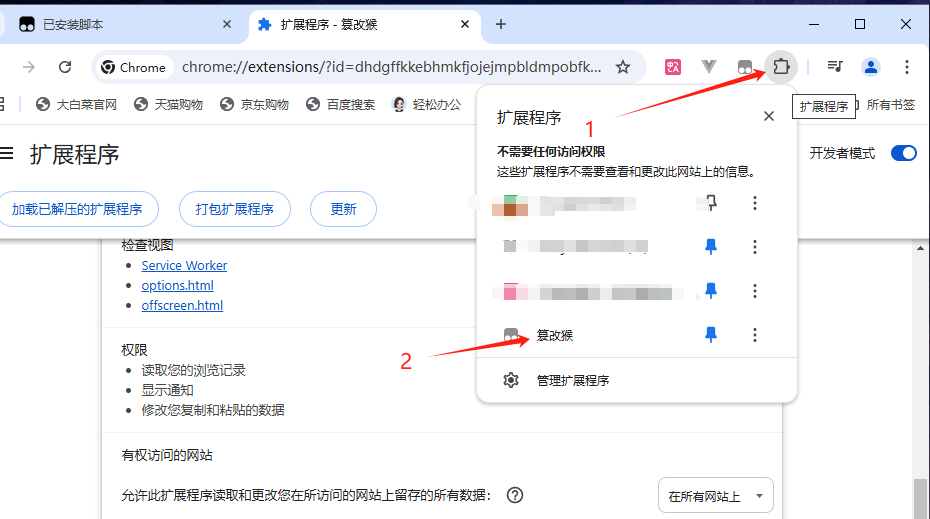
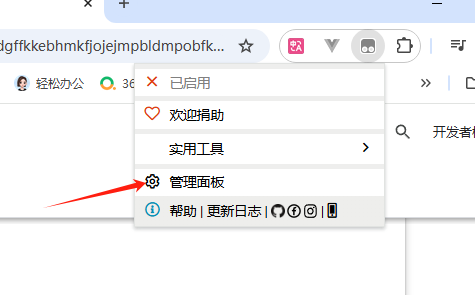
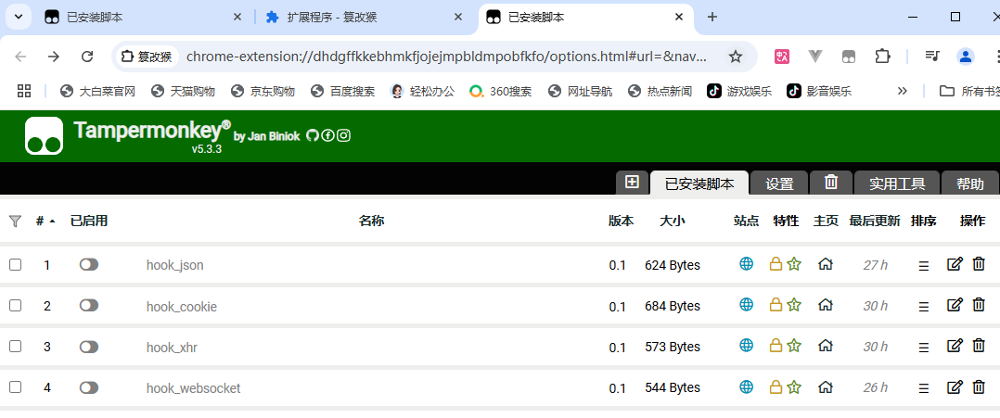
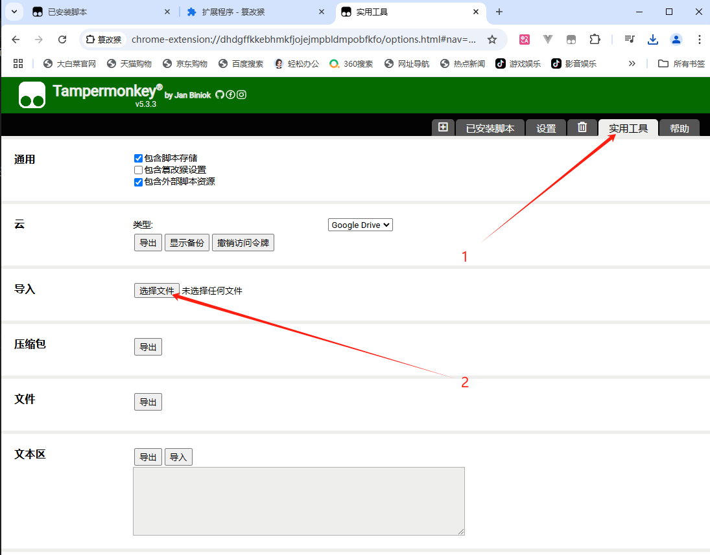
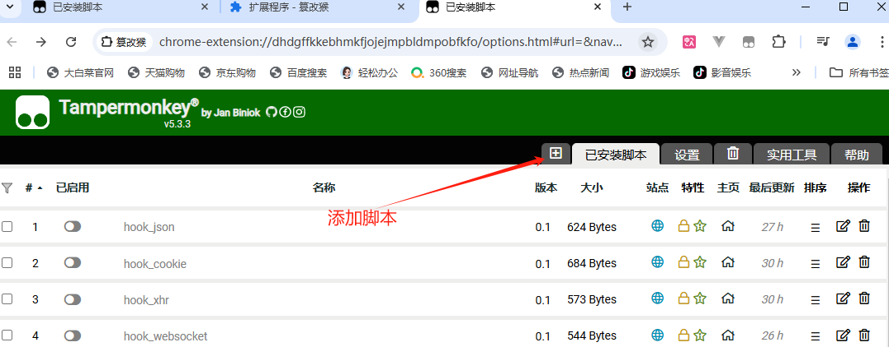
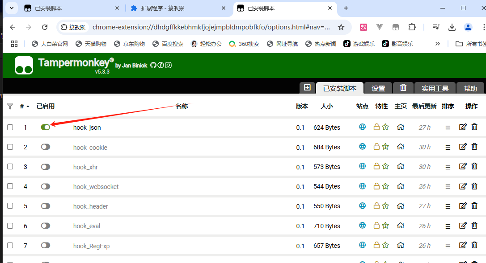
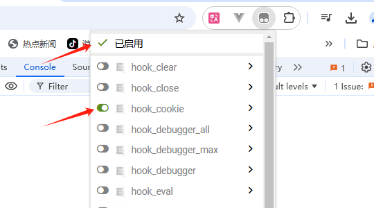
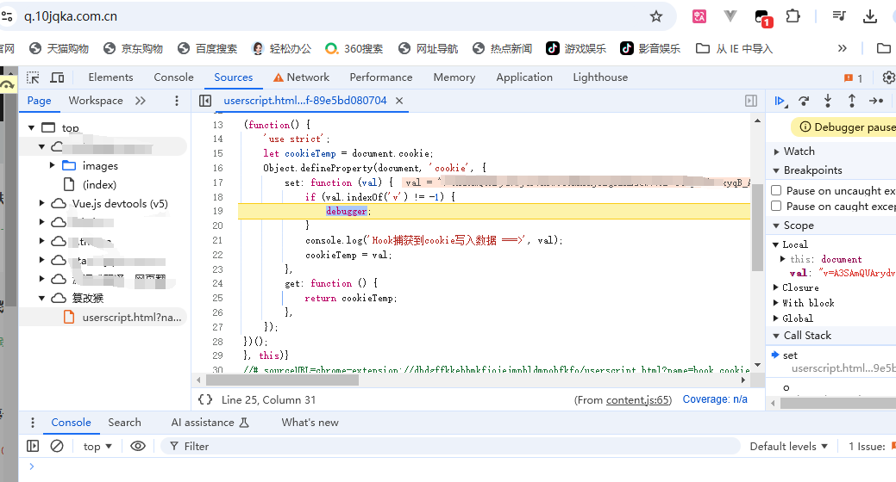

## hook js脚本

主要用于方便调试和了解代码。

**下面是整理的脚本文件**：
```
hook
│
├── /hook_debug            # 包含用于调试相关的hook脚本
│   ├── hook_debugger_all.js           # 跳过debugger方法的断点
│   ├── hook_debugger_all_enhanced.js  # 跳过debugger方法的断点加强版
│   ├── hook_debugger_simple.js        # 简单版本跳过debugger方法
│   ├── hook_eval.js                   # 去除使用eval函数执行debugger的内容
│   └── hook_soJson.js                 # 用于防止soJson对代码是否修改的检测
│
├── /hook_function          # 包含用于函数相关的hook脚本
│   ├── hook_function_mini.js          # 简单版用于函数hook
│   ├── hook_function_constructor.js   # 构造函数hook方式去除debugger内容
│   ├── hook_json.js                   # 在json的函数使用中调试
│   ├── hook_property.js               # 对象的属性读或写
│   ├── hook_RegExp.js                 # 使用正则表达式的hook
│   └── hook_toString.js               # 对所有使用原型toString时的hook
│
├── /hook_network           # 包含用于网络请求相关的hook脚本
│   ├── hook_cookie.js                 # 对cookie的读写进行卡点
│   ├── hook_header.js                 # 对header请求头的读写进行卡点
│   ├── hook_websocket.js              # 对WebSocket使用的卡点
│   └── hook_xhr.js                    # 对xmlhttprequest.open的使用时卡点
│
└── /hook_windows           # 包含用于窗口操作相关的hook脚本
    ├── hook_clear.js                  # 防止清除控制台数据
    ├── hook_close.js                  # 防止检测到调试关闭页面
    ├── hook_freeze_log.js             # 冻结console防止对它的冻结或修改
    ├── hook_history.js                # 防止在本页面历史来回跳转的干扰
    └── hook_log_load.js               # 防止js重写log方法

```

## 油猴使用脚本
废话不多说，直接动手。
### 1.安装油猴
谷歌浏览器，谷歌商店打开安装
https://chromewebstore.google.com/detail/%E7%AF%A1%E6%94%B9%E7%8C%B4/dhdgffkkebhmkfjojejmpbldmpobfkfo

### 2.启用
- 打开拓展管理页面，并启用油猴

- 打开开发者模式，启用油猴拓展

- 进入拓展中



### 3.使用脚本
- 文件导入添加一个脚本


- 复制或者自己写一个脚本


- 启用脚本，F12打开控制台



-执行断点成功



